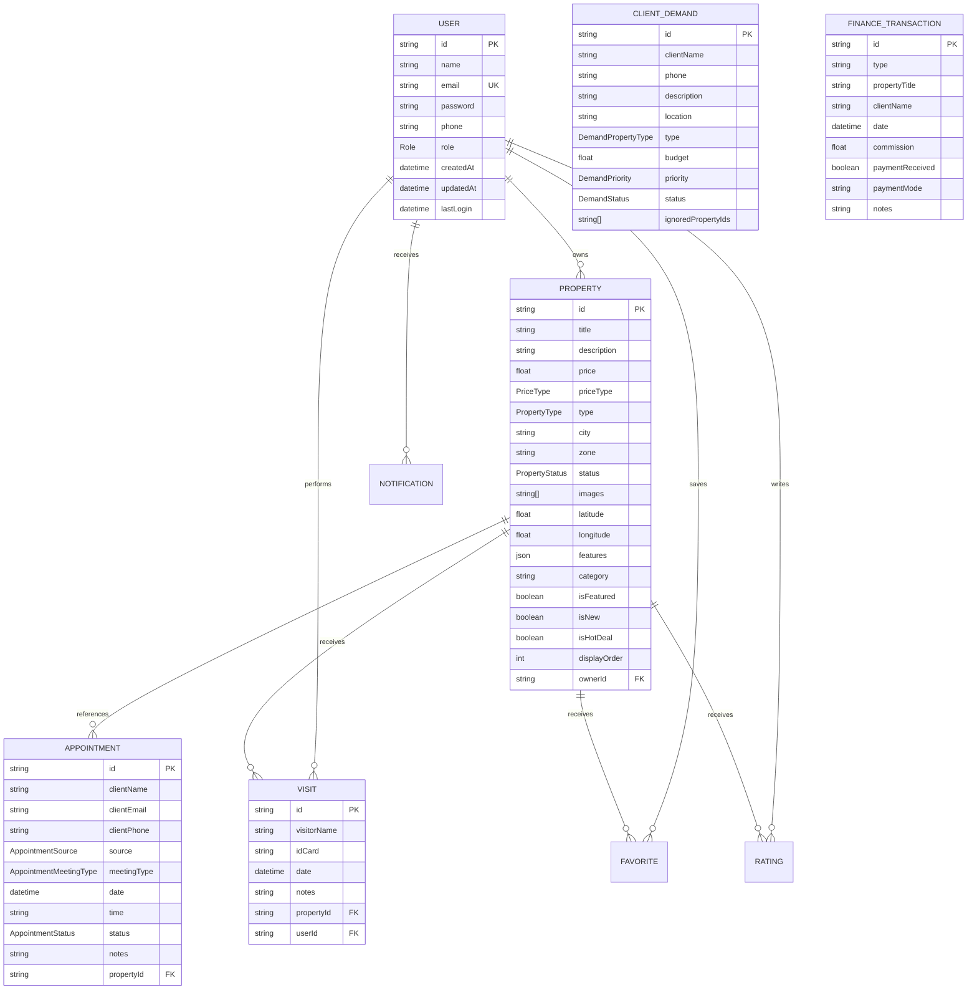

# Product Design Requirements (PDR)
## Look Immo — Tunisian Real Estate Platform (lOOK-IMMO.TN)

**Version:** 1.0  
**Date:** 2026-06-21  
**Status:** Active Development  
**Primary Target Market:** Tunisian Real Estate Industry  
**Language Context:** Bilingual (French for the User Interface, English for Technical Documentation and API design)

---

## 1. Product Overview

**Look Immo** is a modern, full-stack real estate SaaS platform tailored for the Tunisian property market. It provides a real estate agency with a single, integrated hub to:
*   Showcase available properties for sale and rent.
*   Capture public visitor interest and convert them into scheduled appointments or contact inquiries.
*   Manage client relations via an agent/admin CRM (appointment pipeline, demand matching).
*   Perform operational actions (registering walk-in visits with ID cards, tracking commissions).
*   Run content marketing via a publishing blog.
*   Control system-wide options (social links, GPS location, business hours).

### Architecture & Repositories
The workspace is split into two primary components:
1.  **Frontend ([Look-Immo-Front](file:///c:/Users/LOOK%20IMMO/Desktop/lOOK-IMMO.TN/Look-Immo-Front))**: A React 19 + TypeScript SPA built with Vite and styled with TailwindCSS. It handles public navigation, search filters, interactive mapping via Leaflet, user dashboards, and real-time alerts.
2.  **Backend ([Look-Immo-API](file:///c:/Users/LOOK%20IMMO/Desktop/lOOK-IMMO.TN/Look-Immo-API))**: An Express.js REST API using TypeScript and Prisma ORM to interact with a PostgreSQL database. It handles JWT authentication (via httpOnly cookies), file upload pipelines, image compression with Sharp, database seeding, and Socket.IO servers.

---

## 2. Key Objectives & Goals

*   **Premium Visual Showcase:** Render property listings with high-quality galleries, filters, and dynamic interactive maps.
*   **Lead Conversion:** Make it effortless for visitors to book property visits or make contact.
*   **CRM Hub:** Centralize lead tracking, client requests, appointments, and walk-in viewings for agents.
*   **Operations & Finances:** Log financial transactions (sales/rentals), track agency commission metrics, and verify offline client identities (visit records).
*   **Organic Reach:** Drive organic search traffic using optimized SEO meta attributes and blog content.
*   **Multi-Currency Support:** Dynamically convert prices to TND, EUR, and USD to cater to local and foreign investors.

---

## 3. User Roles & Permissions

| Role | Permissions & Capabilities |
| :--- | :--- |
| **Public Visitor** | Browses property listings, filters properties, views the blog, submits contact forms, rates properties, and requests appointments. No login required. |
| **Client (Registered User)** | Has all public visitor capabilities, plus profile editing, saving favorite listings, and viewing/managing their booked appointments in their dashboard. |
| **Agent** | Full access to CRM tools: dashboard metrics, managing appointments (accept, reject, update), client demands, visit logs, and transaction records. |
| **Administrator** | Full system administration. Can manage users and roles, properties (create, edit, delete, reorder), blog posts, site settings, notifications, and view system analytics. |

---

## 4. Tech Stack

### Frontend Layer
*   **Framework & Language:** React 19, TypeScript
*   **Build Tool:** Vite
*   **Styling:** TailwindCSS
*   **Routing:** React Router DOM v7
*   **Maps Integration:** Leaflet / React-Leaflet
*   **Data Visualization:** Recharts
*   **Real-time Communication:** Socket.IO Client
*   **Interactive Components:** `@dnd-kit/core` & `@dnd-kit/sortable` (for property/location reordering)
*   **Icons:** Lucide React

### Backend Layer
*   **Runtime:** Node.js (TypeScript via `ts-node-dev`)
*   **Server Framework:** Express.js
*   **Database Layer:** PostgreSQL
*   **Object-Relational Mapping (ORM):** Prisma Client
*   **Authentication:** JSON Web Token (JWT) with HTTP-only cookies
*   **Security:** Helmet, CORS, express-rate-limit
*   **Data Validation:** Zod
*   **Media Processing:** Multer + Sharp (resizing, WebP/JPEG encoding)
*   **Deployment & Management:** PM2 (ecosystem configuration)

---

## 5. System Features

### 5.1 Public Features (Unauthenticated)

#### 5.1.1 Homepage
*   **Hero Carousel:** Automatically transitions between featured images every 5 seconds. Includes an integrated search overlay.
*   **Search Widget:** Allows searching for "Acheter" (Buy) or "Louer" (Rent) properties across Tunisian cities.
*   **Featured & Hot Properties:** Displays scrollable lists of listings marked `isFeatured` or `isHotDeal`.
*   **Organic SEO:** SEO meta updates for keywords, description, and title are automatically driven page-by-page.

#### 5.1.2 Listings & Filter Page
*   **Flexible Filters:** Filter properties by listing type (Sale/Rent), category (Apartment, Villa, Land, Commercial, Depot, etc.), price range, bedrooms, area size, and city.
*   **Sorting Options:** Sort properties by price, creation date, or size.
*   **Reset Controls:** Easily clear all active filters to view all listings.

#### 5.1.3 Property Details Page
*   **Interactive Gallery:** Offers a full-width image viewport with thumbnail scrolling.
*   **Details & Amenities:** Lists property size, bathrooms, bedrooms, and amenities (AC, heating, pool, garden, security, VOC, COS).
*   **Leaflet Mapping:** Shows the exact or general property location on an interactive map.
*   **Client Booking Widget:** Enables visitors to book appointments by submitting their name, phone, date, time, notes, and contact channel.
*   **User Ratings:** Interactive review module where clients can submit ratings out of 5 stars with a text comment.

#### 5.1.4 Contact & Agency Info
*   **Contact Form:** Submits name, email, phone, subject, and message directly to the backend inbox.
*   **Office Information:** Displays agency location map, phone numbers, and operational hours.

---

### 5.2 Registered User Dashboard

*   **Profile Management:** Edit personal details (name, email, phone) and automatically generate avatar graphics.
*   **Favorites List:** Save property listings to a dedicated favorites tab.
*   **Appointment Management:** Track requested appointments, reschedule date/time, cancel bookings, and view current approval status.

---

### 5.3 Agent & Admin CRM Dashboard

*   **Real-time Analytics:** Track daily appointments, active buyer/tenant demands, and match statuses.
*   **Client Demand Pipeline:** Track buyer requirements (desired category, budget, location) and transition status from `searching` -> `contacted` -> `matched` -> `closed`.
*   **Appointment Actions:** Approve or decline appointment requests, reschedule visits, and log notes.
*   **Working Hours:** Update agency operational hours displayed to the public.

---

### 5.4 Administrative Management

*   **Property CRUD:** Create, edit, and delete properties. Includes drag-and-drop support to arrange image order.
*   **User & Role Management:** Control user accounts, update security clearances, and view registration/login timelines.
*   **Blog Publishing:** Write, update, publish, or draft posts with inline images and category tagging.
*   **Finance Transactions:** Log transaction history, record commission percentages, toggle payment statuses (received/pending), and filter by payment type (cash, check, bank transfer).
*   **Offline Visit Logs:** Document physical property viewings by recording visitor names and ID card numbers.
*   **System Settings:** Customize core settings like site name, email, phone numbers, social media links, and coordinate pins for the maps.

---

## 6. Database Schema Summary

The database uses PostgreSQL with the following core entities defined in [schema.prisma](file:///c:/Users/LOOK%20IMMO/Desktop/lOOK-IMMO.TN/Look-Immo-API/prisma/schema.prisma):

---

## 7. API Endpoints Reference

| Category | Method | Endpoint | Authorization | Description |
| :--- | :--- | :--- | :--- | :--- |
| **Auth** | `POST` | `/api/auth/register` | Public | Create client account |
| | `POST` | `/api/auth/login` | Public | Authenticate & set cookie |
| | `POST` | `/api/auth/logout` | Public | Clear auth session |
| | `POST` | `/api/auth/refresh` | Public | Issue new access token |
| | `GET` | `/api/auth/me` | Authenticated | Get current session user |
| **Properties** | `GET` | `/api/properties` | Public | Search/filter properties |
| | `GET` | `/api/properties/:id` | Public | Fetch property details |
| | `POST` | `/api/properties` | Agent/Admin | Create a new property |
| | `PUT` | `/api/properties/:id` | Agent/Admin | Edit property details |
| | `DELETE` | `/api/properties/:id` | Agent/Admin | Delete property |
| **Appointments** | `POST` | `/api/appointments` | Public | Request a booking |
| | `GET` | `/api/appointments` | Authenticated | View booked appointments |
| | `PUT` | `/api/appointments/:id` | Authenticated | Modify an appointment |
| | `DELETE` | `/api/appointments/:id` | Authenticated | Cancel/delete appointment |
| **Demands** | `GET` | `/api/demands` | Agent/Admin | View client demands |
| | `POST` | `/api/demands` | Agent/Admin | Save client requirement |
| | `PUT` | `/api/demands/:id` | Agent/Admin | Update demand pipeline |
| | `DELETE` | `/api/demands/:id` | Agent/Admin | Delete demand |
| **Visits & CRM** | `GET` | `/api/visits` | Agent/Admin | List walk-in visits |
| | `POST` | `/api/visits` | Agent/Admin | Log visit details |
| | `GET` | `/api/transactions` | Agent/Admin | View logged commissions |
| | `POST` | `/api/transactions` | Agent/Admin | Log sale or rent commission |
| **Settings** | `GET` | `/api/settings` | Public | Fetch site configuration |
| | `PUT` | `/api/settings` | Admin | Edit website settings |
| **Uploads** | `POST` | `/api/upload/property-image` | Agent/Admin | Upload property picture |
| | `POST` | `/api/upload/property-document` | Agent/Admin | Upload PDF agreement |

---

## 8. Non-Functional & System Requirements

### 8.1 Performance
*   **Media Compression:** Image uploads must pass through Sharp pipeline, restricting dimension width to 1400px with a 82% quality setting, outputting web-friendly formats.
*   **Page Loading:** Core public pages (listings, homepage) should render in under 2 seconds.

### 8.2 Security
*   **Session Management:** Keep JWTs in secure, httpOnly cookies to mitigate Cross-Site Scripting (XSS) risks.
*   **Traffic Restraints:** Apply `express-rate-limit` on login, registration, and contact form submissions.
*   **Zod Validations:** Strictly enforce typed boundaries on incoming payloads on the server.

### 8.3 SEO & UI Design
*   **Dynamic Head Tags:** Use react state hooks to modify title and meta descriptions on the fly.
*   **Mobile Adaptiveness:** Fully responsive interface designed via Tailwind CSS viewport prefixes, optimized for 375px up to 1440px widths.
*   **Micro-interactions:** Add interactive hover transitions and dynamic alerts to create a premium feel.

---

## 9. Future Roadmap & Enhancements

*   **Brochure Generator:** Support PDF downloads for property listings.
*   **WhatsApp CRM Sync:** Connect directly with local agents to auto-schedule appointments.
*   **CDN Integration:** Store user-uploaded images on AWS S3 or Cloudinary instead of the backend filesystem.
*   **Arabic Language Toggle:** Fully support dual French/Arabic translation options.
*   **Virtual Viewing:** Enable interactive 360-degree virtual property tours.
